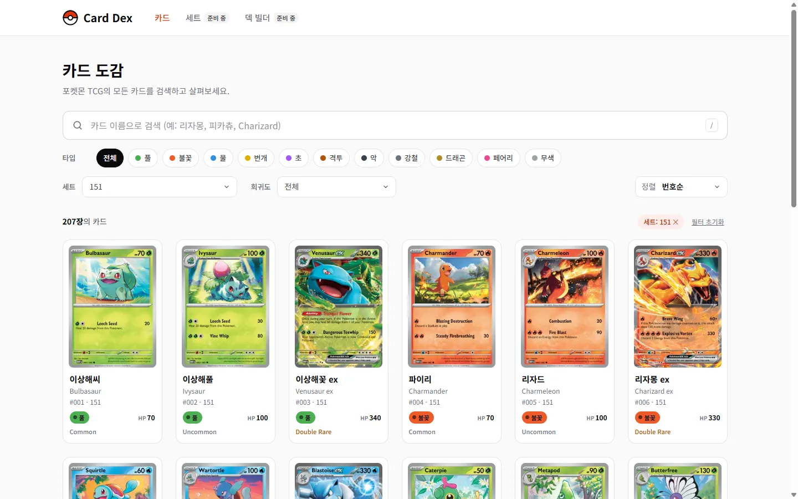
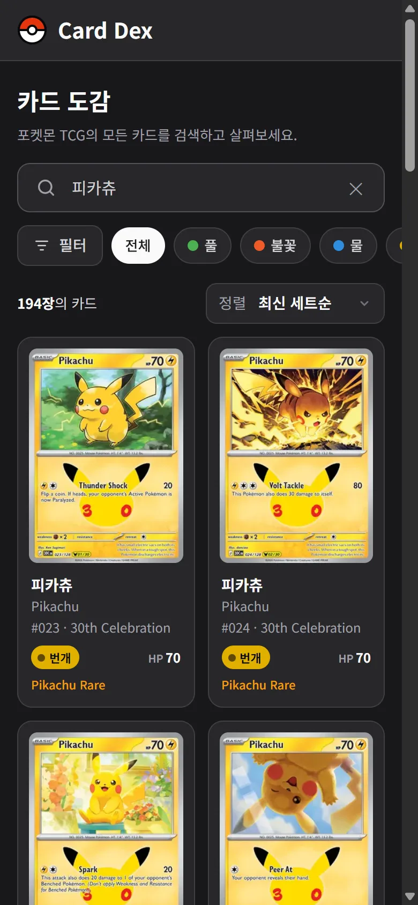
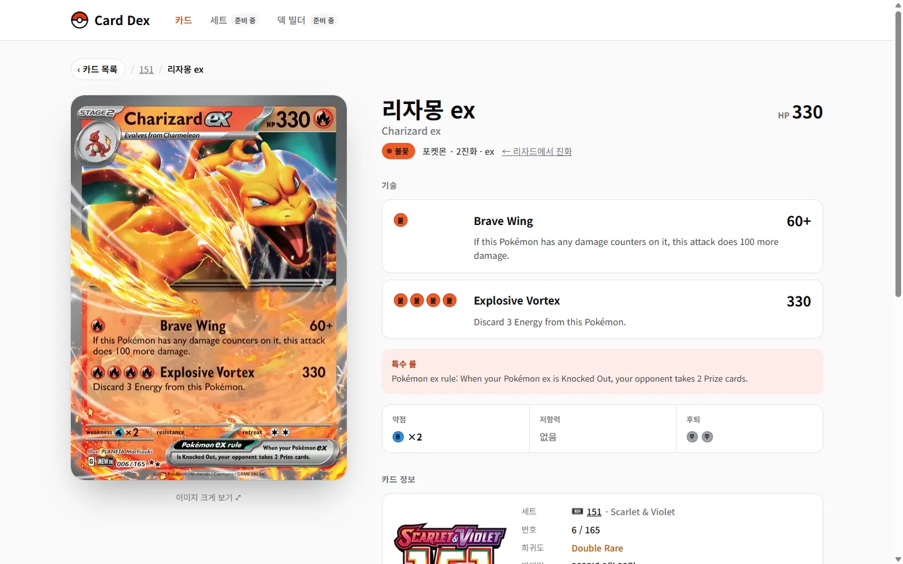
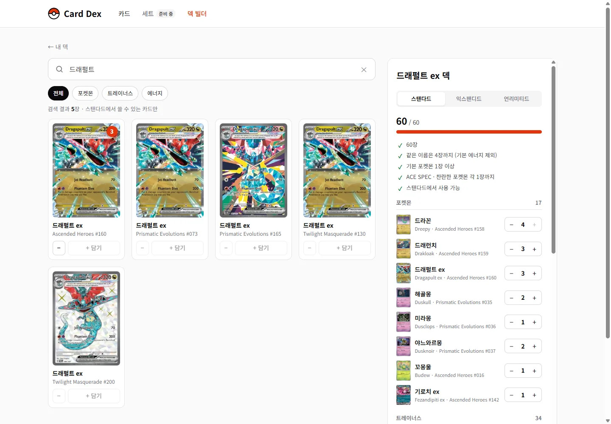

# Pokémon Card Dex

포켓몬 트레이딩 카드 게임(TCG)의 카드 **20,635장**을 한국어·영어로 검색하고, 상세 정보를 보고, 60장 덱을 짜 볼 수 있는 웹 카드 도감입니다.

**🔗 https://pokemon-card-dex-green.vercel.app**  ·  개발 버전(develop): [pokemon-card-dex-git-develop-dydqls-projects.vercel.app](https://pokemon-card-dex-git-develop-dydqls-projects.vercel.app)

<table>
  <tr>
    <td width="64%"></td>
    <td rowspan="2"></td>
  </tr>
  <tr>
    <td></td>
  </tr>
  <tr>
    <td colspan="2"></td>
  </tr>
</table>

## 주요 기능

- **한국어·영어 검색** — "리자몽", "메가 리자몽", "Charizard" 모두 검색. 띄어쓰기·대소문자·악센트(Flabébé) 무시
- **한국어 카드 이름** — 포켓몬 카드는 공식 한국어 포켓몬 이름으로 번역(99.3%). 예) Charizard ex → 리자몽 ex, Misty's Gyarados → 이슬의 갸라도스
- **트레이너스 카드 한국어 이름** — 게임 공식 아이템·장소명(Rare Candy → 이상한사탕, Prism Tower → 프리즘타워)과, 한국 공식 카드 검색에서 한 장씩 대조한 이름 사전(Arven → 페퍼, Professor's Research (Professor Sada) → 박사의 연구(올림박사))으로 1,123장 번역. 공식명을 확인하지 못한 카드는 영어 그대로
- **덱 빌더** — 카드를 골라 60장 덱 구성(모바일은 "카드 찾기 | 덱" 탭)
  - 규칙 검사: 60장, 같은 이름 4장(기본 에너지 제외), 기본 포켓몬, ACE SPEC·찬란한 포켓몬 1장, 스탠다드(레귤레이션 H 이후)·익스팬디드 사용 가능 여부(언리미티드는 사용 가능 여부 검사 없음)
  - Pokémon TCG Live 덱 목록 붙여넣기로 가져오기, 같은 형식으로 내보내기
  - 로그인 없이 브라우저에 저장, 덱 내용을 담은 링크로 공유(받은 덱은 항상 새 덱으로 저장)
- **필터와 정렬** — 타입·세트·희귀도 필터, 최신/오래된 세트순·이름순·번호순, 상태는 URL에 저장(새로고침·공유·뒤로 가기 유지)
- **카드 상세** — 큰 이미지 뷰어, 기술·특성(에너지 비용), 약점·저항력·후퇴, 세트 정보, 대회 사용 가능 여부, 같은 세트의 이전/다음 카드, 같은 포켓몬의 다른 카드
- **탐색 흐름 유지** — 상세에서 돌아오면 필터·페이지·스크롤 위치(모바일 "더 보기"로 쌓은 목록 포함) 복원
- **반응형·접근성** — 6열 → 2열 그리드, 다크 모드, 키보드 조작, 스크린 리더 레이블, 강조색 글자·버튼 WCAG AA 대비, Lighthouse(모바일, 정식 주소) 접근성·권장사항·SEO 100점
- **보안** — CSP·X-Frame-Options 등 보안 헤더, API 파라미터 화이트리스트와 길이·개수 제한, 프로토타입 키(`constructor`, `__proto__`) 방어, 붙여넣은 덱 목록·공유 링크·저장소 값을 한 곳에서 검증

## 기술 스택

| 구분 | 사용 기술 |
|---|---|
| 프론트엔드 | React 19, TypeScript, Vite 8, React Router 7, CSS Modules |
| 서버 | Vercel Functions (`api/cards.ts`) |
| 데이터 | 자체 보유 카드 데이터([pokemon-tcg-data](https://github.com/PokemonTCG/pokemon-tcg-data)) + 공식 한국어 포켓몬·아이템·장소 이름([PokéAPI](https://github.com/PokeAPI/pokeapi)) + 트레이너스 이름 사전 |
| 덱 저장 | 브라우저 localStorage (버전 관리), 공유는 URL 쿼리 |
| 이미지 | 자체 변환 WebP, GitHub Pages 호스팅 |
| 배포 | Vercel (`main` → 정식, `develop` → 개발 버전) |
| 도구 | Figma, oxlint, Chrome DevTools, Lighthouse, Notion |

## 구조

```
                      ┌─ scripts/build-data.mjs ───> data/          카드 20,635장 · 세트 176개 · 한국어 이름
  (빌드 시 한 번 생성) ─┤
                      └─ scripts/build-images.mjs ─> GitHub Pages   카드 이미지 WebP (245px · 440px)

  브라우저 ──> /api/cards  (Vercel Function, server/cardsApi.ts)    검색 · 상세 · 이전/다음 · 관련 카드 · 덱 카드 일괄 조회
          ├──> 카드 이미지  (GitHub Pages, 실패하면 원본 이미지로 대체)
          └──> localStorage (덱 저장, 서버에는 저장하지 않음)
```

- 외부 API를 실시간으로 호출하지 않습니다. 카드 데이터는 고정된 커밋에서 생성하고(`data/meta.json`), 서버 함수가 메모리에 올려 응답합니다(검색 수 ms, 응답은 엣지에 하루 캐시).
- 개발 서버(`npm run dev`)도 같은 서버 코드를 사용해 배포 환경과 동작이 같습니다.

## 문제 해결 기록

### 1. 절반이 실패하는 외부 API
처음에는 [Pokémon TCG API](https://pokemontcg.io)를 브라우저에서 직접 호출했지만, 요청의 절반가량이 500/502로 실패했습니다. 실패 응답에는 CORS 헤더도 없어 브라우저에서는 원인조차 보이지 않았습니다.
→ 클라이언트 재시도(지수 백오프)·타임아웃·캐시를 넣고, 이어서 같은 출처 프록시(Vercel Function)로 서버 쪽 재시도와 엣지 캐시를 도입해 브라우저 오류를 0건으로 만들었습니다.

### 2. 외부 API 종료 (2027-03-01)
이 API는 2027년 3월 1일 종료되고 후속 서비스는 유료였습니다.
→ API가 쓰던 공개 데이터를 직접 보유하고 자체 카드 API로 전환했습니다. 카드 이미지(원본 14GB)도 WebP로 변환해 직접 호스팅하고, 문제가 생기면 원본 이미지로 대체되게 했습니다. 외부 의존이 사라지면서 오류가 없어지고 검색이 빨라졌습니다.

### 3. 한국어 카드 이름 품질
도감 번호로 공식 한국어 이름을 붙였더니 "Erika's 뚜벅쵸"처럼 반만 번역된 이름이 703장 나왔습니다.
→ **이름 전체를 확신 있게 번역할 수 있을 때만 한국어, 아니면 영어**로 정책을 정하고, 트레이너 소유격(Erika's → 민화의)·폼(연격, 오리진 등) 사전과 TAG TEAM 분리 번역을 추가해 섞인 이름을 0건으로 만들었습니다.

### 4. 탐색 흐름이 끊기는 문제
페이지 이동 뒤 스크롤이 다시 아래로 끌려가는 문제(브라우저 스크롤 앵커링), 모바일에서 "더 보기"로 쌓은 목록이 상세에서 돌아오면 초기화되는 문제가 있었습니다.
→ 결과 영역의 `overflow-anchor`를 끄고 렌더 후 스크롤하도록 바꾸고, 쌓은 페이지 수를 history 항목별로 저장해 캐시에서 첫 화면에 그대로 다시 그리도록 했습니다.

### 5. 공식 데이터가 없는 트레이너스 카드 이름
포켓몬 이름과 달리 트레이너스 카드(서포트·아이템·스타디움)의 공식 한국어 이름은 공개 데이터가 없었습니다. 게임 아이템 이름을 그대로 붙이자 서포트 카드 "Black Belt"가 아이템 "검은띠"가 되는 오역도 생겼습니다.
→ 게임 공식명은 카드 종류별로만 쓰고(아이템명은 아이템·도구, 장소명은 스타디움), 나머지는 초안을 만든 뒤 qa가 한국 공식 카드 검색에서 한 장씩 대조해 **확인된 이름만** 넣었습니다(띄어쓰기까지 공식 표기). 초안의 절반 이상(약 59%)은 공식 검색에서 확인되지 않아 영어로 두었고, 처음 넣은 사전 항목도 다시 검증해 9건을 고치고 4건을 뺐습니다.

### 6. 덱 규칙의 스탠다드 판정
원본 카드 데이터의 대회 사용 가능 여부가 갱신되지 않아, 이미 스탠다드에서 빠진 F 레귤레이션 카드는 "사용 가능", 최신 세트는 "사용 불가"로 나왔습니다(qa 발견).
→ 데이터 값 대신 카드의 **레귤레이션 마크**로 판정하도록 바꿨습니다(2026-04-10 로테이션 기준 H 이후). 기본 에너지는 항상 사용 가능하고, 데이터의 금지 카드는 그대로 반영합니다. 원본 데이터의 분류 오류(포켓몬이 트레이너스로 들어간 카드)는 카드 id별 보정 목록으로 고칩니다.

## 개발 방식

[Claude Code](https://claude.com/claude-code) 세션 세 개로 역할을 나눠 개발했습니다. qa와 Security는 코드를 수정하지 않고, 찾은 문제를 code 세션에 리포트합니다.

| 세션 | 역할 |
|---|---|
| code | 기획 정리, Figma 디자인, 구현, 커밋·배포 |
| qa | 기능 검증 — 배포 미리보기와 브라우저 자동화로 레이아웃·라우팅·접근성·성능(Lighthouse)·데이터 품질 확인. 트레이너스 카드 이름은 한국 공식 카드 검색에서 한 장씩 대조 |
| Security | 보안 점검 — 코드 리뷰, 보안 헤더·CSP, 입력 퍼징(파서·공유 링크·API 파라미터), 데이터 무결성, 공급망(고정 커밋·npm audit), 배포 공개 범위(경로·source map), 커밋 이력의 비밀값 |

- 단계마다 **Figma 디자인 → `feature/*` 구현 → qa 검증 + Security 점검 → 수정 → 재검증 → `develop` 병합** 순서로 진행했습니다. 두 세션이 모두 통과해야 병합합니다.
- 리포트는 재현 방법·기대/실제 결과·파일 위치·심각도로 정리됩니다. 예) (모두 수정 후 재검증 완료)
  - qa: 스탠다드 판정이 오래된 데이터 기준(High), 모바일 "더 보기" 목록 초기화, 특수 에너지가 "기본 에너지"로 번역됨
  - Security: 정렬 파라미터 `constructor`로 500 오류(프로토타입 키), 보안 헤더 부재, 덱 이름의 글자 방향 제어 문자(U+202E)로 표시 위장
- 정식 배포 뒤에는 qa가 정식 주소를 다시 점검(Lighthouse 포함)하고, Security가 헤더·API 방어를 다시 확인합니다.
- 작업은 Notion 보드(상태별·표·간트)로 관리했습니다.

```
main        ← 기능이 모두 완성됐을 때 병합 (정식 배포)
 └ develop  ← 기능 통합 (데모 자동 배포)
    └ feature/<기능명>  ← 기능 단위 작업
```

## 시작하기

Node.js 20.19 이상 또는 22.12 이상이 필요합니다.

```bash
npm install
npm run dev          # 개발 서버 (기본 http://localhost:5173, /api/cards 포함)
npm run build        # sitemap 생성 + 타입 검사 + 프로덕션 빌드
npm run lint         # 린트
npm run build:data   # 카드 데이터 다시 생성 (data/, src/data/)
node scripts/build-images.mjs <출력 폴더>   # 카드 이미지 WebP 생성 (재실행하면 이어서 진행)
```

## API

| 요청 | 설명 |
|---|---|
| `GET /api/cards?name=&type=&set=&rarity=&supertype=&format=&sort=&page=&pageSize=` | 검색 (`sort`: newest, oldest, name, number / `supertype`: Pokémon, Trainer, Energy / `format`: standard, expanded / `pageSize` 최대 250) |
| `GET /api/cards/batch?ids=a,b,c` | 여러 카드를 한 번에 (최대 60개, 덱 빌더용) |
| `GET /api/cards/:id` | 카드 상세 |
| `GET /api/cards/:id/neighbors` | 같은 세트의 이전/다음 카드 |
| `GET /api/cards/:id/related?limit=` | 같은 포켓몬(또는 같은 이름)의 다른 카드 |

## 폴더 구조

```
api/cards.ts         Vercel Function 진입점
server/cardsApi.ts   카드 API (개발 서버와 공유)
scripts/             build-data.mjs(카드 데이터·한국어 이름·포맷), build-images.mjs(이미지),
                     trainer-names-ko.json(트레이너스 이름 사전), build-og-image.mjs(링크 미리보기 이미지)
data/                생성된 카드 데이터
docs/design/         디자인 시안
src/
├─ api/              카드 API 클라이언트 (재시도·타임아웃·캐시)
├─ components/       화면 구성 요소 (CSS Modules)
│  ├─ detail/        카드 상세 섹션
│  └─ deck/          덱 빌더 (카드 선택, 덱 목록, 규칙 검사, 가져오기·내보내기 대화상자)
├─ data/             필터용 세트·희귀도 목록 (생성됨)
├─ hooks/            useCardSearch, useDecks, useApiResource, useUrlParams 등
├─ lib/              필터 ↔ URL ↔ API 변환, 표시 문구
│  └─ deck.ts        덱 저장·규칙·PTCG Live 텍스트·공유 링크
├─ pages/            CardListPage, CardDetailPage, DeckListPage, DeckEditorPage, SharedDeckPage
└─ types/            카드 타입
```

## 로드맵

- [x] 카드 목록·검색·필터, 카드 상세, 배포
- [x] 자체 데이터·이미지 호스팅, 한국어 이름·검색
- [x] 정식 공개 v1.0.0 (`main`)
- [x] v1.0.1 첫 화면 속도, 링크 미리보기 이미지
- [x] 트레이너스 카드 한국어 이름 (공식 카드 검색과 대조)
- [x] 덱 빌더 (M4) — `develop`에서 사용 가능, 정식 배포 예정(v1.1.0)
- [ ] 덱 통계(타입·종류별 장수), 카드 상세에서 바로 덱에 담기
- [ ] 새 세트 데이터 추가 (원본 데이터 저장소가 2026-09 이후 갱신되지 않음)

## 출처

- 카드 데이터: [PokemonTCG/pokemon-tcg-data](https://github.com/PokemonTCG/pokemon-tcg-data)
- 한국어 포켓몬·아이템·장소 이름: [PokéAPI](https://github.com/PokeAPI/pokeapi) (BSD-3-Clause)
- 트레이너스 카드 한국어 이름: [포켓몬카드게임 공식 카드 검색](https://pokemoncard.co.kr/cards)에서 카드별로 직접 확인한 표기 (자동 수집하지 않음)
- 스탠다드 레귤레이션: [2026 Standard Format Rotation Announcement](https://www.pokemon.com/us/pokemon-news/2026-pokemon-tcg-standard-format-rotation-announcement)
- 카드 이미지: Pokémon TCG API 이미지를 변환해 호스팅

Pokémon 및 관련 상표·이미지의 권리는 Nintendo, Creatures, GAME FREAK, The Pokémon Company에 있으며, 이 프로젝트는 학습·포트폴리오 목적의 비공식 팬 프로젝트입니다.
