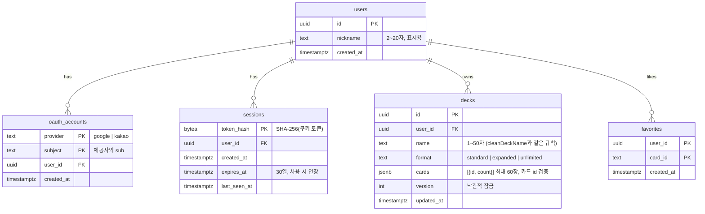

# M6 로그인·회원가입 + 사용자 데이터 — 설계

- 상태: 초안 (2026-10-08) · 검토: qa, Security
- 결정 배경: [ADR 0003 모노레포·API 서버](../adr/0003-monorepo-and-api-server.md), [ADR 0004 소셜 로그인·세션](../adr/0004-social-login-and-sessions.md)

## 1. 범위

| 이번(M6) | 이후 |
|---|---|
| 구글·카카오 로그인, 로그아웃, 모든 기기 로그아웃, 탈퇴 | 이메일 가입(도메인 후) |
| 내 덱을 계정에 저장(브라우저 덱 가져오기 포함) | 덱 공개·공유 페이지 |
| 관심 카드(하트) | 가격 알림(M8) |
| 마이페이지(닉네임), 개인정보처리방침·이용약관 | 거래자 프로필·평가(M8) |
| 모노레포 전환, NestJS 서버, CI/CD | 경매·포인트(M7) |

## 2. 구성

```
브라우저 ──> pokemon-card-dex-green.vercel.app
              ├─ /api/cards/*, /api/prices   Vercel Functions (그대로)
              └─ /api/v1/*  ──rewrite──> Cloud Run (asia-southeast1) · NestJS
                                              ├─ AuthModule      /auth/{google|kakao}/start, /callback, /logout
                                              ├─ SessionGuard    쿠키 → 세션 조회 → req.user
                                              ├─ MeModule        /me (닉네임, 탈퇴, 모든 기기 로그아웃)
                                              ├─ DecksModule     /decks CRUD, /decks/import
                                              └─ FavoritesModule /favorites
                                              ↓ (app role: api_rw)
                                        Neon PostgreSQL (production / dev)
```

- 모노레포: `apps/web`(지금 앱), `apps/api`(NestJS), `packages/shared`(Drizzle 스키마·zod 검증·타입)
- API 서버는 **별도 DB 계정 `api_rw`**: 사용자 테이블만 권한. 시세 함수의 `app_rw`와 분리(서로의 테이블을 못 건드림)
- 비밀 값: Secret Manager → Cloud Run 환경변수 (`DATABASE_URL`, `GOOGLE_CLIENT_SECRET`, `KAKAO_CLIENT_SECRET`), 저장소·채팅에 없음

## 3. 데이터 모델 (ERD)



- 모든 외래 키는 `ON DELETE CASCADE` → 탈퇴 한 번에 전부 삭제
- 한도: 사용자당 덱 100개(지금 브라우저 한도와 같음), 관심 카드 500장 — DB 제약 + 서버 검증
- 덱 저장은 `version`으로 낙관적 잠금: 두 기기에서 동시에 고치면 나중 저장이 409("다른 곳에서 바뀌었어요")

## 4. 로그인 흐름 (구글 예시, 카카오 동일)

1. `GET /api/v1/auth/google/start?next=/decks` — `state`, `nonce`, PKCE `code_verifier` 생성 → 10분짜리 쿠키 `__Host-oauth`(서명·암호화)에 저장 → 구글로 302
2. 구글 → `GET /api/v1/auth/google/callback?code&state`
   - 쿠키의 state와 대조, code + code_verifier로 토큰 교환
   - id_token 검증: JWKS 서명, `iss`, `aud`(우리 client id), `exp`, `nonce`
   - `(google, sub)`로 계정 조회, 없으면 사용자 생성(닉네임은 기본값 "트레이너1234", 나중에 변경)
   - 새 세션 생성 → `__Host-session` 쿠키 → `next`(우리 사이트 내부 경로만 허용)로 302
3. 이후 요청: `SessionGuard`가 쿠키 해시로 세션 조회(만료 확인, 슬라이딩 연장은 하루 1번만 기록)

## 5. 브라우저 덱 → 계정 덱

- 로그인 후 덱 페이지에서 "이 브라우저의 덱 N개를 계정에 저장할까요?" 한 번 묻기
- `POST /api/v1/decks/import` — 기존 `sanitizeDeck` 규칙(shared로 이동)으로 검증, 이름이 같으면 "(가져옴)" 붙임, 한도 초과분은 결과로 알림
- 로그인 상태에서는 계정 덱을 보여주고 브라우저 저장은 쓰지 않음(로그아웃 상태는 지금처럼 브라우저 저장)

## 6. 보안 체크리스트 (Security 점검 항목)

- [ ] OAuth: state·nonce·PKCE, id_token 검증(JWKS·iss·aud·exp·nonce), 콜백 `next`는 내부 경로만(오픈 리다이렉트 방지)
- [ ] 세션: `__Host-` 쿠키, 해시 저장, 로그인 시 새 토큰, 만료·로그아웃 즉시 무효, 탈퇴 시 전부 삭제
- [ ] CSRF: SameSite=Lax + 상태 변경은 Origin·Content-Type 확인
- [ ] 권한: 모든 사용자 데이터 쿼리에 `user_id = 세션 사용자` 조건(다른 사람 덱 id로 접근 시 404)
- [ ] 입력: zod 스키마(shared) — 덱 이름·카드 id·수량·개수 한도, 알 수 없는 필드 거부
- [ ] 요청 제한: 로그인 시작·콜백·쓰기 API에 IP·사용자별 제한
- [ ] DB: `api_rw` 최소 권한, 바인딩만, 오류는 일반 메시지
- [ ] 배포: Workload Identity(키 파일 없음), Secret Manager, Cloud Run은 Vercel 프록시 경유만 받도록(헤더 비밀 값 확인)
- [ ] 개인정보: 최소 수집, 처리방침 페이지, 탈퇴 즉시 파기, 로그에 토큰·쿠키 남기지 않음

## 7. 테스트

- 단위(Vitest/Jest): 세션 토큰 해시·만료·연장, next 경로 검증, 덱 검증(shared)
- 통합: NestJS e2e + **Neon 임시 브랜치**(CI 실행마다 dev에서 분기 → 끝나면 삭제) — 실제 PostgreSQL로 권한·제약까지 확인
- OAuth는 제공자 응답을 흉내 낸 가짜 서버(JWKS 포함)로 테스트 — 서명 위조·nonce 불일치·만료 토큰 거부 확인
- qa: 실제 구글·카카오 계정으로 미리보기에서 로그인 흐름, 덱 가져오기, 탈퇴

## 8. 작업 순서

1. 모노레포 전환(동작 변화 없음) — qa 회귀 확인
2. NestJS 뼈대 + `/api/v1/health` + Cloud Run 배포 파이프라인 + Vercel 프록시
3. 사용자·세션 스키마, `api_rw` 계정, 구글 로그인
4. 카카오 로그인
5. 서버 덱·관심 카드·브라우저 덱 가져오기
6. 화면: 로그인 버튼·마이페이지·하트·개인정보처리방침·이용약관
7. qa·Security 검토 → v1.3.0

## 9. 사용자 준비물 (해당 단계에서 안내)

- 2단계: Google Cloud 계정·결제 카드 등록·프로젝트 생성 (나머지 설정은 CLI로)
- 3단계: Google OAuth 클라이언트 등록(동의 화면 포함)
- 4단계: 카카오 디벨로퍼스 앱 등록(OpenID Connect 켜기)
