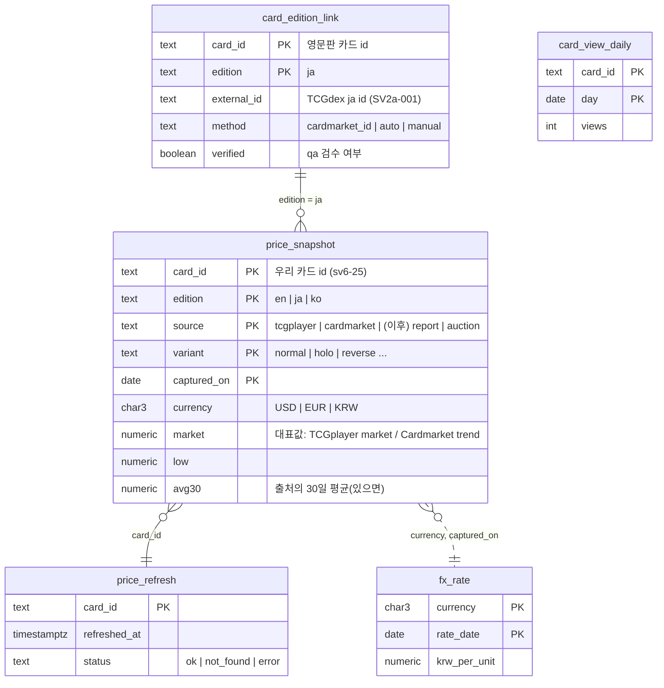

# M5 카드 시세 — 설계

- 상태: 초안 (2026-10-08) · 검토: qa, Security
- 결정 배경: [ADR 0001 시세 출처](../adr/0001-price-data-sources.md), [ADR 0002 DB·ORM](../adr/0002-database-and-orm.md)

## 1. 범위

| 이번(M5) | 이후 |
|---|---|
| 영문판 시세(TCGplayer USD·Cardmarket EUR) → 원화 | 등급(PSA) 시세 — 유료 출처 필요 |
| 일본판 시세(Cardmarket EUR) + 영문판↔일본판 연결표 | 한글판 사용자 제보 — 로그인(M6) 이후 |
| 시세 이력을 매일 쌓고 30·90일 그래프 | 한글판 낙찰가 — 경매(M7) 이후 |
| 한글판: 크림·번개장터 **검색 링크**(수집 없음) | 관심 카드 가격 알림 — M8 |

## 2. 구성

```
              매일 1회 (Vercel Cron)                  상세 페이지 조회
                       │                                   │
                       ▼                                   ▼
            /api/cron/prices ─────────┐        GET /api/cards/:id/prices
            (CRON_SECRET 확인)         │                    │
                       │               │       24시간 지났으면 그 카드만 새로 받기
                       ▼               ▼                    │
              TCGdex API (카드별)   Frankfurter(환율)        │
                       │               │                    │
                       └──────► Neon PostgreSQL ◄───────────┘
                                (바뀐 값만 저장)
```

- **하루 갱신 대상(예산 2,000장)**: 스탠다드 사용 가능 카드 → 최근 7일간 많이 조회된 카드 순. 동시 요청 4개, 실패는 다음 날 다시.
- **조회 시 갱신**: 그 카드의 마지막 갱신이 24시간 넘었을 때만 TCGdex에 요청(3초 제한, 실패하면 저장된 값으로 응답). 카드당 하루 1회로 묶여서 요청량의 상한은 카드 수와 같다.
- **환율**: Cron에서 USD·EUR·JPY → KRW를 하루 1회 저장. 시세는 **그날의 환율**로 환산(그래프가 환율 변동도 반영).

## 3. 데이터 모델 (ERD)



- 카드 자체는 지금처럼 빌드된 JSON(`data/`)에 있고, DB에는 **시세와 연결 정보만** 둔다(카드 id로 연결).
- **바뀐 값만 저장**: 오늘 값이 마지막 저장 값과 같으면 행을 추가하지 않는다(그래프는 계단식으로 이어 그림).
- **용량 계산**: 하루 최대 약 2,000장 × 출처 2 × 변형 1.5 = 6,000행, 실제 변경은 그 일부 → 연 수십 MB 수준. 0.5GB 한도의 경고선(400MB)을 넘으면 90일 지난 이력을 주 단위 1행으로 줄이는 정리 작업을 돌린다.
- **이상치 거르기**: 직전 값 대비 10배 이상/10분의 1 이하로 바뀐 값은 저장하되 그래프·대표값에서 제외(`flag` 열 추가 예정), TCGplayer `highPrice`(예: 999)는 쓰지 않는다.
- `card_view_daily`: 갱신 우선순위용 조회수(카드 id·날짜·횟수만, 개인정보 없음). 30일 지난 행은 지운다.

## 4. API

| 엔드포인트 | 설명 |
|---|---|
| `GET /api/cards/:id/prices?range=30d\|90d` | 판본별 최신 시세(원화 + 원래 통화), 기간 이력, 출처·기준 시각. 한글판은 시세 대신 외부 검색 링크 |
| `GET /api/cron/prices` | Vercel Cron 전용. `Authorization: Bearer $CRON_SECRET`이 아니면 401. 응답에 처리 수만 |

응답 예:

```json
{
  "card": "sv6-25",
  "editions": {
    "en": {
      "latest": { "krw": 4083, "amount": 3.05, "currency": "USD", "source": "tcgplayer", "variant": "holo", "capturedOn": "2026-10-08" },
      "others": [{ "krw": 3881, "amount": 2.9, "currency": "EUR", "source": "cardmarket" }],
      "history": [{ "date": "2026-09-10", "krw": 3950 }]
    },
    "ja": { "latest": null, "linked": false },
    "ko": { "links": { "kream": "https://kream.co.kr/search?keyword=…", "bunjang": "https://m.bunjang.co.kr/search/products?q=…" } }
  },
  "fxDate": "2026-10-08",
  "note": "참고용 시세입니다"
}
```

- 캐시: `s-maxage=3600`(한 시간), 갱신 직후에는 새 값.
- 외부 검색 링크의 검색어는 카드의 한국어 이름 + 번호로 만들고 `encodeURIComponent`, 새 창(`rel="noopener noreferrer"`).

## 5. 화면 (카드 상세 · 시세 섹션)

```
┌ 시세 ──────────────────────────────── 참고용 · 2026.10.08 기준 ┐
│ [영문판] [일본판] [한글판]                                       │
│                                                                 │
│  ₩4,083        US$3.05 · TCGplayer 시장가                        │
│  유럽 ₩3,881 (€2.90 · Cardmarket 추세가)                          │
│                                                                 │
│  ▁▂▂▃▅▄▅▆▆▅  30일 | 90일                                         │
│                                                                 │
│  한글판 탭: "한글판 시세는 아직 없어요" + [크림에서 보기] [번개장터에서 검색] │
└─────────────────────────────────────────────────────────────────┘
```

- 그래프는 의존성 없이 SVG로 그리고, 표(스크린리더용)도 함께 제공.
- 시세가 없으면 "아직 시세 정보가 없어요", 불러오기 실패 시 다시 시도 버튼(기존 상세 섹션과 같은 패턴).
- 레이아웃 밀림 방지: 섹션 높이를 미리 확보(스켈레톤).

## 6. 보안 체크리스트 (Security 점검 항목)

- [ ] `DATABASE_URL`·`CRON_SECRET`은 서버에서만, 응답·로그·번들에 없음
- [ ] 앱 접속은 최소 권한 역할 `app_rw`(이 테이블들의 SELECT/INSERT/UPDATE, 정리 작업만 DELETE)
- [ ] 모든 쿼리는 Drizzle/`sql` 템플릿의 바인딩
- [ ] Cron 엔드포인트 인증, 조회 시 갱신은 카드당 하루 1회로 제한(외부 요청 증폭 방지)
- [ ] 외부 응답(TCGdex·Frankfurter)은 숫자·범위 검증 후 저장, 스키마 밖 필드 무시
- [ ] 외부 링크는 `noopener noreferrer`, 검색어 인코딩
- [ ] CSP `connect-src 'self'` 유지(브라우저는 우리 API만 호출)

### Security 설계 검토 반영 (2026-10-08)

**필수**
1. 존재하지 않는 카드 id는 DB·외부 요청 전에 404(카드 목록 Map 확인) — 무작위 id로 DB를 채우는 용량 공격 차단
2. 갱신 권한을 **원자적으로 선점**한 요청만 TCGdex 호출:
   `INSERT … ON CONFLICT (card_id) DO UPDATE SET refreshed_at = now(), status = 'pending' WHERE price_refresh.refreshed_at < now() - interval '24 hours' RETURNING card_id`
   실패·시간 초과도 그날의 1회로 친다(오류 재시도가 증폭 경로가 되지 않게)
3. `range`는 `30d|90d`만(그 외 400), 다른 쿼리 파라미터는 무시 — 캐시 우회 방지
4. `CRON_SECRET`이 없거나 32자 미만이면 항상 401(fail closed), `timingSafeEqual` 비교, Production·Preview에 서로 다른 Sensitive 값, 응답 `no-store`·처리 수만
5. `app_rw` 권한은 테이블별로 좁힌다
   - `price_snapshot`: SELECT, INSERT (+ 주 단위 정리용 DELETE)
   - `price_refresh`, `fx_rate`: SELECT, INSERT, UPDATE
   - `card_view_daily`: SELECT, INSERT, UPDATE, DELETE(30일 정리)
   - `card_edition_link`: SELECT만(쓰기는 소유자 역할 스크립트)
   - TRUNCATE·REFERENCES·TRIGGER·스키마 CREATE 없음, `statement_timeout = '5s'`, 연결 수 제한, 새 테이블마다 GRANT를 마이그레이션에 명시
6. 외부 응답 검증: 호스트 상수 고정·경로는 `encodeURIComponent`·다른 호스트로 리다이렉트 금지, 응답 1MB 상한·content-type 확인, 숫자는 `isFinite`·0 이상·상한(100,000), **통화·variant는 허용 목록**(PK라서), 환율이 전날 대비 ±20% 넘으면 저장만 하고 직전 정상값 사용

**권고 (채택)**
- 조회 시 갱신의 **하루 전체 예산**(3,000회, DB 카운터) — 넘으면 저장된 값만
- 조회 시 3초 기다리지 않고 **저장된 값을 바로 응답**, 갱신은 `waitUntil`로 뒤에서 → 다음 요청에 새 값
- Cron 예산 중 조회수 기반은 최대 30%(나머지는 스탠다드 카드), 조회수는 캐시 미스일 때만 기록
- 오류·404 응답은 짧게 캐시하거나 `no-store`
- Cron은 Hobby 실행 시간 한도를 확인하고, 넘으면 커서로 이어서 처리
- 로그에는 정리된 메시지만(쿼리·파라미터·접속 정보가 담긴 오류 객체 통째 금지), 마이그레이션은 로컬에서 소유자로만
- 새 의존성(drizzle-orm, @neondatabase/serverless, drizzle-kit) `npm audit`, TCGdex `ja` 데이터는 고정 커밋

## 7. 작업 순서

1. Drizzle 스키마·마이그레이션, `app_rw` 역할 생성(dev → production)
2. TCGdex·Frankfurter 수집기 + Cron 엔드포인트(dev에서 수동 실행해 검증)
3. `GET /api/cards/:id/prices` + 조회 시 갱신
4. 상세 페이지 시세 섹션(SVG 그래프)
5. 일본판 연결표: Cardmarket 상품 id → 자동 대조 → qa 검수
6. qa·Security 검토 → develop → v1.2.0
